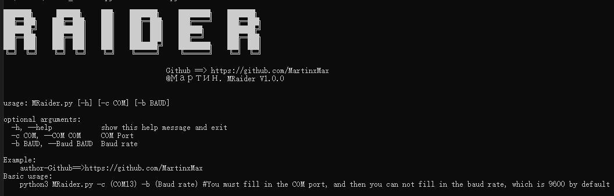
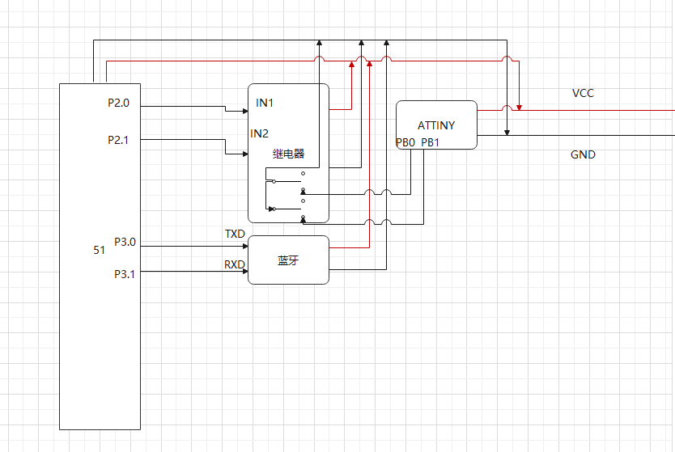
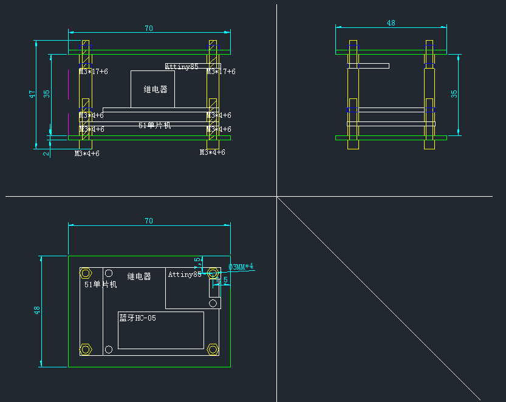
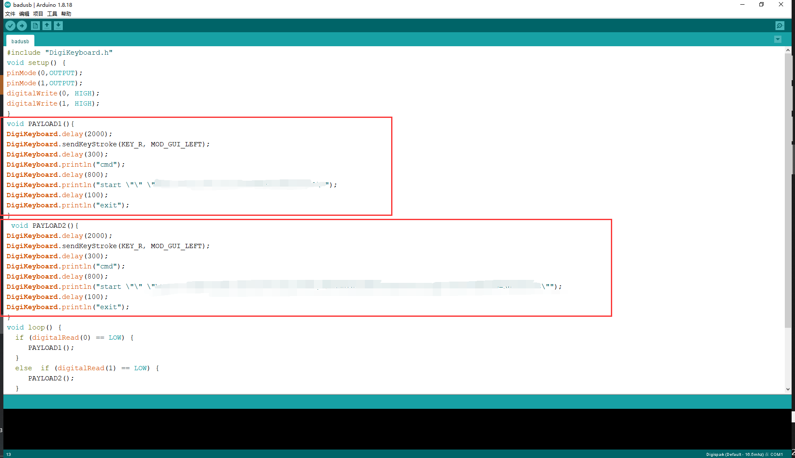
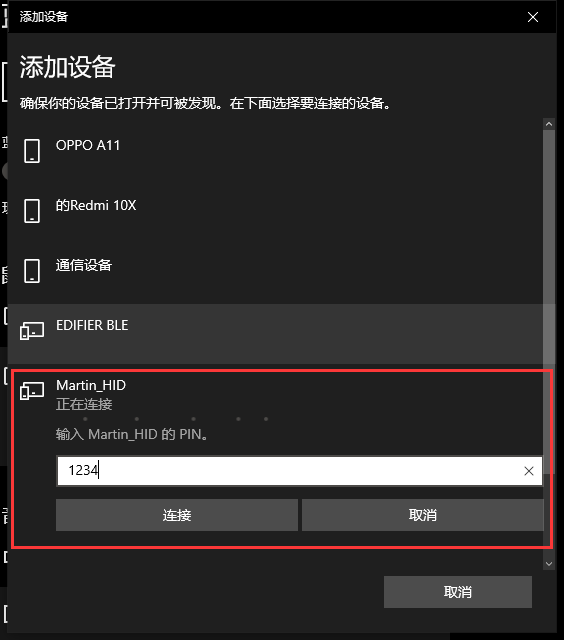
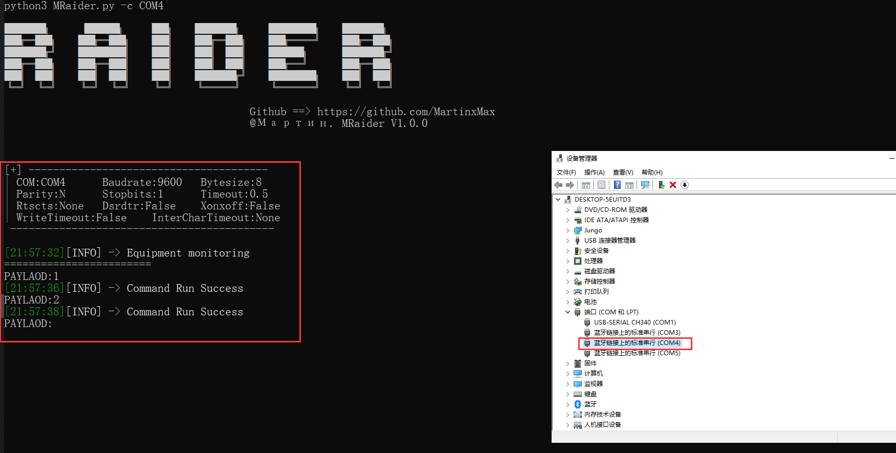
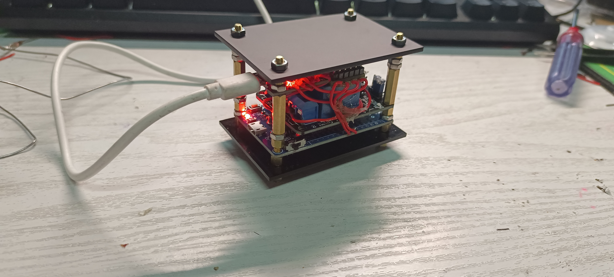
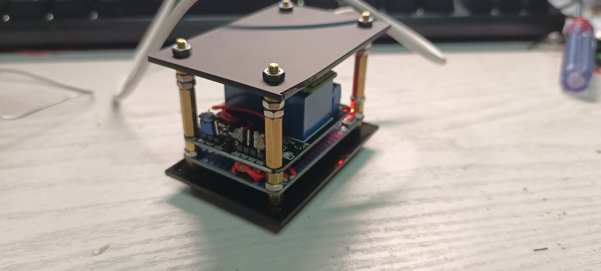
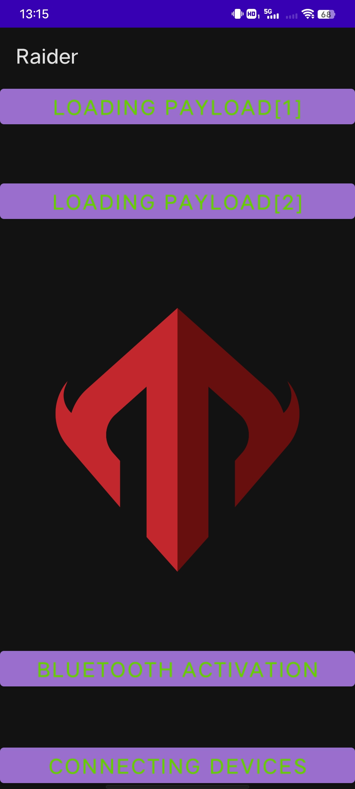

<div align="center">
 
 <p align="center">
 
 
 
  
 
 </p>
   
 <table>
      <tr>
          <th>Function</th>
      </tr>
      <tr>
        <th>Bluetooth near-source penetration attack</th>
      </tr>
    </table>
</div>

## usage method

  * View help information

      ```#python3 MRaider.py -h```
      
  

## Resource Preparation 

  

  

  

  

  

  

  


## Android


  
